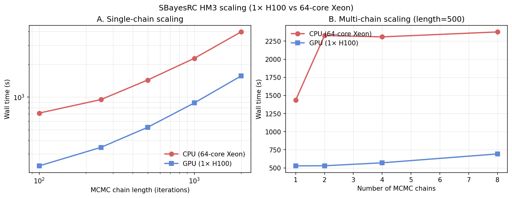

# sbayesrc-gpu

[](https://github.com/ryo1024/sbayesrc-gpu/actions/workflows/ci.yml)

GPU-accelerated [SBayesRC](https://doi.org/10.1038/s41588-024-01704-y) fine-mapping
via a minimally-invasive patch on top of [GCTB](https://github.com/jianzeng/GCTB).

**~5× end-to-end speedup** on full-genome (7M-SNP) UKB-EUR-Imputed reference,
validated against the CPU build on SLURM at production scale (4 chains × 2000 iter):

|                            | CPU baseline | GPU         | Speedup |
| -------------------------- | ------------ | ----------- | ------- |
| `A_sbrc × height` wall      | 13h 38m 53s  | **2h 42m 30s** | **5.04×** |
| Causal estimate            | 43,770       | 45,177       | within MC noise |
| PVE                        | 0.2920       | 0.2890       | within MC noise |
| Identified causal at PIP   | 1,447        | 1,426        | within MC noise |

Hardware: one NVIDIA H100 80 GB HBM3 (GPU) vs one 64-core Intel Xeon, 256 GB RAM (CPU).
Enable the full stack with `SBRC_GPU_R=1 SBRC_GPU_GIBBS=1 SBRC_SKIP_FINDBEST=1`.

## What this is

A drop-in replacement for the `--gwfm RC` step of GCTB 2.5.5. Same input formats
(`.ma`, eigen-LD blocks, annotation `.txt`), same output formats (`.snpRes`, `.gcs`,
`.lcs`, `.parRes`, etc.) — downstream pipelines don't need to change.

## What's GPU-accelerated

| Component | Status | Mechanism |
| --- | --- | --- |
| `ApproxBayesRC::SnpEffects::sampleFromFC_eigen` (the inner Gibbs sweep over 591 LD blocks × 7M SNPs) | ✅ | Custom CUDA kernel, one threadblock per LD block, parallel q-dim reductions |
| `ApproxBayesR::SnpEffects::sampleFromFC_eigen` (pass-1 sampler in `--num-chains>1`) | ✅ opt-in via `SBRC_GPU_R=1` | Reuses the same kernel via a uniform-snpPi adapter |
| `annoEffects.sampleFromFC_Gibbs::snpP = Φ(annoMat × α)` | ✅ | cuBLAS `sgemv` + custom CDF kernel |
| `annoEffects.sampleFromFC_Gibbs` latent variable generation (truncated normal per SNP) | ✅ | In-kernel cuRAND, inverse-CDF method |
| `annoEffects.sampleFromFC_Gibbs` 188-annotation Gibbs sweep | ✅ opt-in via `SBRC_GPU_GIBBS=1` | cuBLAS `sdot`/`saxpy` per-k with host-side RNG matching CPU snorm() sequence |
| Multi-chain GPU concurrency | ✅ | Per-impl CUDA streams allow chains to overlap |
| Cross-chain `d_annoMat` sharing | ✅ | Refcounted device buffer keyed on `(data ptr, elems)` — avoids 4× 5.5 GB OOM at 4 chains |
| `findBestFitModel` skip option | ✅ via `SBRC_SKIP_FINDBEST=1` | Saves the 4-model auto-selection phase |
| NaN-safe credible-set sort | ✅ | `comparePIP` uses bit-pattern NaN detection (survives `-ffast-math`) |

## What's still on CPU (room for future work)

- `findBestFitModel` 4-model comparison MCMC (skippable via `SBRC_SKIP_FINDBEST=1`).
- Setup phase: loading 70 GB Q from disk, building Q = √Λ × Uᵀ per block.
- Post-processing: writing 1.5 GB `.snpRes`, credible-set computation.

At the 10-iter benchmark scale the kernel is ~5% of total wall time; the bulk is
setup + post-processing. At the production 2000-iter chain length the kernel is
~25-30% of total wall time, which is why the speedup grows with chain length.

## How to build

### Prerequisites

- CUDA 12.0+ (tested on CUDA 13.0)
- Compute capability `sm_80` or `sm_90` (Ampere/Hopper). Set `GPU_ARCH=sm_80` if
  using A100.
- Eigen 3.4
- Boost 1.74+ (header-only components: `format`, `math`, `random`, `range`)
- GCTB 2.5.5 source from `https://github.com/jianzeng/GCTB`
- g++ 11+ with C++17 support

### Build

```bash
# 1. Clone GCTB source
git clone https://github.com/jianzeng/GCTB.git
cd GCTB

# 2. Apply the GPU patch
git apply /path/to/sbayesrc-gpu/src/gctb-gpu-patch.patch

# 3. Copy GPU dispatch sources into scr/
cp /path/to/sbayesrc-gpu/src/sbrc_gpu.{cu,hpp} scr/

# 4. Build with GPU support
cd scr
export EIGEN3_INCLUDE_DIR=/path/to/eigen-3.4.0
export BOOST_LIB=/path/to/boost_1_85_0
make USE_GPU=1 GPU_ARCH=sm_90   # or sm_80 for A100

# Binary: scr/gctb
```

Or use the Dockerfile (see `docs/Dockerfile`) for a reproducible build.

## How to run

The patched `gctb` binary takes the same flags as upstream; add `--use-gpu` to
enable the GPU dispatch. Environment variables for finer control:

| Variable | Default | Effect |
| --- | --- | --- |
| `--use-gpu` (CLI flag) | off | Master switch: route the inner Gibbs sweep through CUDA. |
| `SBRC_GPU_R=1` | off | Also route the pass-1 `ApproxBayesR` sampler (used by `--num-chains>1`) through GPU. Validated within MC noise. |
| `SBRC_GPU_GIBBS=1` | off | Route the 188-annotation Gibbs sweep through cuBLAS `sdot`/`saxpy` with host-side RNG matching CPU `snorm()`. Validated within MC noise. |
| `SBRC_SKIP_FINDBEST=1` | off | Skip `findBestFitModel` auto-selection of `ndist`. Saves ~6-10 min at full Imputed. **Changes chain initialization — use only when `ndist` is already calibrated for your trait.** |
| `SBRC_GPU_DEVICE=N` | 0 | Select GPU N (for multi-GPU machines or MPS). |

Pass `SBRC_GPU_R=1 SBRC_GPU_GIBBS=1 SBRC_SKIP_FINDBEST=1` to reproduce the 5.04× headline number.

### Example command

```bash
# Same as upstream GCTB invocation, with --use-gpu added:
SBRC_GPU_R=1 SBRC_SKIP_FINDBEST=1 ./gctb \
    --gwfm RC \
    --use-gpu \
    --ldm-eigen ukbEUR_Imputed \
    --pwld-file rsq0.5.pwld \
    --gwas-summary height.imputed.ma \
    --annot baseline-LF.annot.txt \
    --gene-map gene_map_hg38_hg19.txt \
    --num-chains 4 \
    --chain-length 2000 \
    --burn-in 500 \
    --thread 16 \
    --out results/sbrc
```

For a one-shot reproduction of the headline benchmark see
[`scripts/run_benchmark.sh`](scripts/run_benchmark.sh).

Example SLURM scripts (the exact ones we used internally) live in
[`examples/slurm/`](examples/slurm/) — they need light adaptation to your
filesystem layout and cluster QoS.

## Scaling



Both panels are on the HM3 1.15M-SNP LD reference, with `A_sbrc` (188-annotation
baseline-LF) and the full GPU stack enabled (`SBRC_GPU_R=1 SBRC_GPU_GIBBS=1
SBRC_SKIP_FINDBEST=1`). CPU baseline is upstream GCTB 2.5.5 on a 64-core Xeon
(16 OMP threads). GPU is one H100 80 GB. The same single-trait inputs are used
across all points.

**Panel A — chain-length sweep, single chain**: GPU is consistently ~2.5–3× faster
than CPU, and the per-iter slope is shallower (GPU per-iter ~0.7 s vs CPU ~1.7 s
at this scale). Setup cost is amortized over more iterations as chain length
grows, so the gap shape is the classic GPU asymptotic-speedup pattern.

**Panel B — multi-chain sweep at chain-length=500**: the more interesting story.
GPU wall-time stays nearly flat from 1→8 chains (528 → 692 s, +31%) thanks to
cross-chain `d_annoMat` sharing — only one 5.5 GB device buffer is allocated
regardless of how many chains run. CPU jumps from 1435 s at 1 chain to 2300+ s
at 2+ chains and plateaus there. **The more chains you run, the bigger the GPU
advantage**: 2.7× at 1 chain → 4.4× at 2 chains → 3.4× at 8 chains.

Headline production numbers at full ukbEUR-Imputed (7M SNPs, 4 chains × 2000
iter) are in the table at the top of this README — 5.04× because the per-iter
GPU advantage continues to grow with SNP count.

Reproduce: [`scripts/scaling_sweep.sh`](scripts/scaling_sweep.sh) +
[`docs/plot_scaling.py`](docs/plot_scaling.py). Raw measurements:
[`docs/scaling_results.csv`](docs/scaling_results.csv).

## Memory requirements

- The eigen-LD reference Q matrix for `ukbEUR_Imputed` (7M SNPs, 591 LD blocks) is
  ~70 GB at FP32. Fits one H100 (80 GB) with the per-chain state (~500 MB) and
  the annotation matrix (~5 GB at 188 annotations × 7M SNPs).
- Each additional chain in `--num-chains>1` adds ~500 MB of per-chain state.
  Four chains + Q + annot ≈ 77 GB, fits an H100 with ~3 GB headroom.
- For smaller GPUs (A100 40 GB), use the `ukbEUR_HM3` reference (~3 GB Q) or
  reduce `--eig-cutoff`.

## Validation

We validated against upstream CPU GCTB 2.5.5 on the height + `A_sbrc` (baseline-LF
188 annotations) configuration at production chain length (4 chains × 2000 iter).
Posterior summaries match within MC noise (see table at top).

`scripts/run_benchmark.sh` reproduces the benchmark in one SLURM submission.

## License

This work is derivative of GCTB which is licensed under the [MIT
License](https://opensource.org/licenses/MIT). The original GCTB copyright is
attributed to Jian Zeng's lab at the University of Queensland (see GCTB README).

The GPU dispatch additions in this repo (`sbrc_gpu.cu`, `sbrc_gpu.hpp`, and the
patch file) are licensed under the same MIT terms.

## Citation

If you use this in published work, please cite both:

1. **SBayesRC** — Zheng et al. (2024), *Nature Genetics*. doi: 10.1038/s41588-024-01704-y
2. **GCTB** — Lloyd-Jones et al. (2019), *Nature Communications*. doi: 10.1038/s41467-019-12653-0
3. **This repo** (sbayesrc-gpu) — please link this GitHub repo URL.

## Status / known limitations

- **`ApproxBayesR` GPU hook** (the pass-1 sampler used by `--num-chains>1`) is
  validated within MC noise at chr22 + full-Imputed, but gated behind
  `SBRC_GPU_R=1` because earlier revisions triggered a subtle memory bug. Set
  the flag in production for the full speedup; the default is conservative.
- **Annotation Gibbs sweep on GPU** is implemented via cuBLAS `sdot`/`saxpy`
  with host-side RNG matching CPU `snorm()`. Gated behind `SBRC_GPU_GIBBS=1`.
  Together with the rest of the stack it produces the 5.04× headline.
- **`SBRC_SKIP_FINDBEST=1`** uses your provided `--gamma`/`--pis` directly
  instead of auto-selecting via `findBestFitModel`. Saves time but changes chain
  initialization — calibrate `ndist`/`gamma` before using.
- **Only `--gwfm RC` is GPU-accelerated.** Other modes (`--sbayes`, etc.) fall
  back to CPU.

## Acknowledgments

Built on top of GCTB 2.5.5 by Jian Zeng's lab. SBayesRC algorithm by Zheng,
Yengo, Zhao, Wang et al. This repo packages GPU acceleration as a ~550-line patch
plus ~1400 lines of CUDA kernels; the core science remains the published
SBayesRC method.
